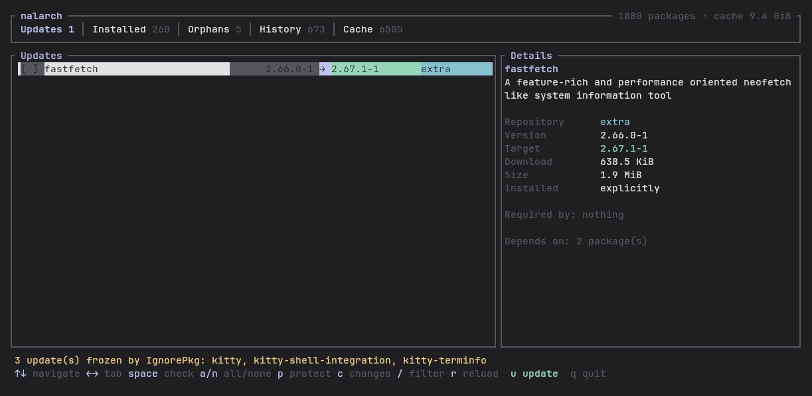
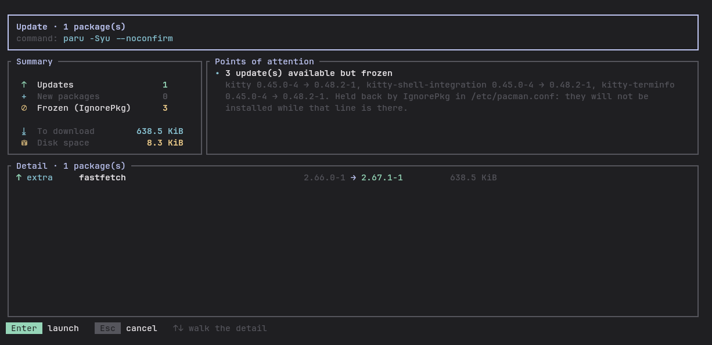
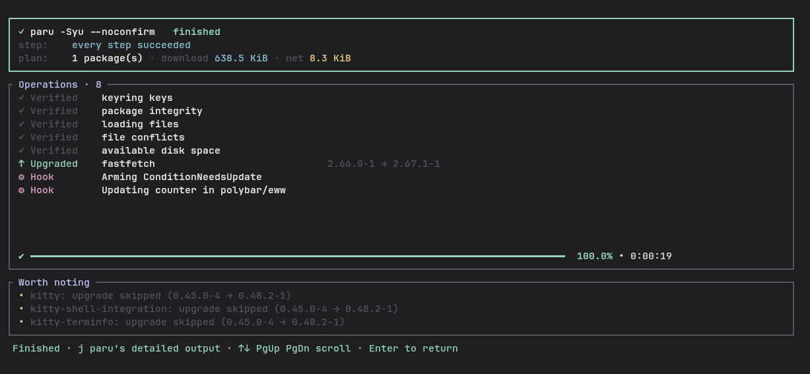
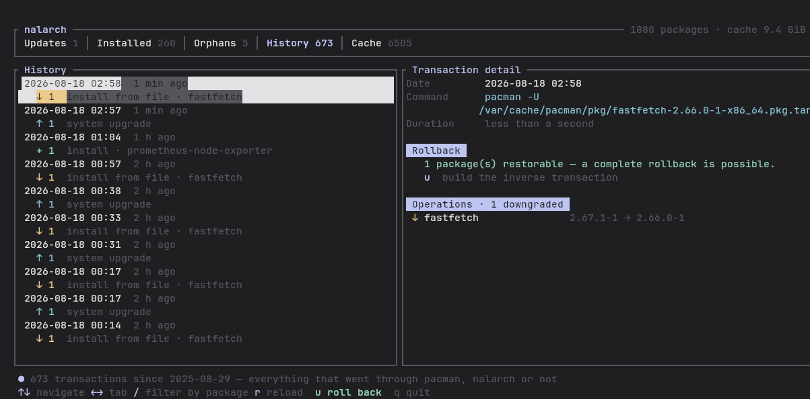
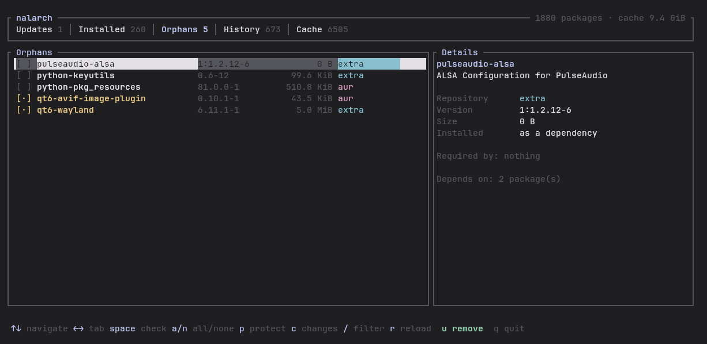

# nalarch

A **TUI** package manager for Arch Linux, in the spirit of [nala](https://github.com/volitank/nala)
on the Debian side: see what is about to change, move around in it, decide, then apply.

*[Version française](README.fr.md).*



## Principle

**libalpm for reading, paru for writing.**

No dependency resolution and no AUR build logic is reimplemented. `nalarch` reads the
database through `libalpm` — the same library pacman and paru use — shows the state, then
**delegates every action to `paru`**, which stays the sole owner of the transaction. That is
what keeps the tool short and safe: it cannot diverge from paru's behaviour, because paru is
what acts.

paru does not run *beside* nalarch: it runs **inside** it, in a pseudo terminal. The
interface is never left.

```
             ┌─ libalpm ────────────► state, plan, sizes, reverse dependencies
   nalarch ──┤
             └─ PTY ──► paru ──► vt100 ──► framed panel, step, prompts
```

The pseudo terminal is what makes the integration possible: paru and pacman check whether
their output is a terminal. On a plain pipe they drop colours and progress bars, and `sudo`
refuses to read a password. With a PTY, paru behaves exactly as it would in a real terminal
and nalarch gets its complete output. Since that output is not linear text — progress bars
rewrite themselves with carriage returns, pacman moves the cursor to show several parallel
downloads — it goes through a terminal emulator (`vt100`) that reconstructs the real screen.

Keystrokes are forwarded to paru verbatim during a run, Ctrl-C included: its questions get
answered and the sudo password typed without leaving nalarch.

To detect updates, `nalarch` relies on `checkupdates` rather than `pacman -Sy`.
`checkupdates` syncs into a temporary database: no risk of leaving the system in a *partial
upgrade*.

## Language

The interface speaks English by default and French when the environment asks for it.
`LC_ALL`, `LC_MESSAGES` and `LANG` are consulted in that order; `--lang en` / `--lang fr`
overrides them.

English is the source language: every message appears in English at its call site in the
code, and `src/i18n.rs` holds the French table keyed by the English text. A missing
translation degrades to English rather than to a key name — and a test scans the source tree
for `t()` / `tf()` call sites and fails the build when one has no entry, so a French
interface cannot quietly grow English sentences.

This is unrelated to the locale forced on paru: see [Pinned locale](#pinned-locale).

## Features

| Tab | Contents | Action (`u`) |
|---|---|---|
| **Updates** | repositories + AUR, old → new version, download size | `paru -Syu` |
| **Installed** | explicit packages nothing depends on (≈ `pacman -Qett`) | `paru -Rns` |
| **Orphans** | pulled in as a dependency, needed by nothing now (= `pacman -Qdt`) | `paru -Rns` |
| **History** | every past transaction, and what a rollback would restore | `pacman -U` from the cache |
| **Cache** | volume, old versions, uninstalled packages | `paccache -rk<N>` / `U` → `-ruk0` |

The retention `<N>` is not hard-coded: it is read from `PACCACHE_ARGS`
(`/etc/conf.d/pacman-contrib`), the same one `paccache.timer` applies. Otherwise the cache
would oscillate between two policies on every run.

The detail panel always shows **what depends on the selected package** (`Required by` /
`Optional for`) — the thing to look at before any removal.

## The three screens

**Table** → **Summary** → **Run**. Nothing launches without going through the summary.

### The summary screen

This is nalarch's reason to exist. A package manager does print everything worth knowing,
but mixed into hundreds of log lines: one ends up reading none of it and approving in hope.
Here it all fits on one screen.



**New packages** are the least visible and most useful addition: `checkupdates` only shows
already-installed packages that have a newer version, never the dependencies an upgrade
pulls in along the way. nalarch gets them from `pacman -Sup --print-format`, run against
`checkupdates`' temporary database — fresh data, no privilege, no writes.

The categories mirror nala's (`Operation` in `src/libnala/transaction.rs`), adapted to
pacman: updates, new packages, downgrades, removals, cascade removals, and frozen packages —
the equivalent of its `Held`.

**Cascade removals** are the removal-side counterpart of new dependencies: `-Rns` takes
along dependencies nothing needs any more, and that is often the bulk of the operation.
Removing `asciiquarium` takes `perl-term-animation` and `perl-curses` with it — 789 KiB
instead of the checked package's 28 KiB. The list comes from `pacman -Rsp`, a dry run with
no privilege. (`-n` and `-p` are incompatible in pacman; omitting it does not change the
list, since `-n` only concerns configuration files.)

**Points of attention** are computed, not decorative. Detected: AUR builds (a PKGBUILD is
unreviewed code running under your account), partial upgrades, kernel updates and DKMS
modules to rebuild, essential system components, downgrades, new dependencies, updates
frozen by `IgnorePkg`. For a removal: packages still needed by others, and the reminder that
plugins loaded at run time are invisible.

The rule followed: only announce what is **verified**. A vague warning is quickly ignored,
and a list that gets ignored protects nothing.

### The run screen

Laid out in blocks, like nala's: what is downloading, what is running, then what is left to
know. Each block carries its own bar, because there is no single measure of progress —
downloading and installing are two separate counts, and mixing them would give a number that
means nothing.



The **Worth noting** block gathers what calls for an action on your side and what the output
drowns: `.pacnew` files to merge, a required reboot, warnings, errors. Each entry says what
to do, not only what happened — a `.pacnew` comes with the `sudo pacdiff -s` command and the
reminder that without it, the new configuration never applies.

paru's detailed output stays available through `j`, including once the operation has
finished. The reboot is inferred from the plan — pacman does not signal it, and the symptom
shows up much later, when nothing connects it back to the upgrade any more.

### Pinned locale

The child process runs with `LC_ALL=C`. Parsing translated output would be untenable: every
language changes the verbs, and a translation update would break the parser silently. In
English the vocabulary is stable, taken straight from pacman's own strings.

None of that English reaches the screen unmediated: `src/journal.rs` restates everything —
phases, actions, and the common warnings — and the result goes through the same translation
layer as the rest of the interface. An unrecognised message passes through as it is, because
an English sentence beats a lost one.

That parsing is what makes the transcript possible. nalarch used to keep only a counter and
a phase: enough to fill a bar, not enough to tell the story of the operation.

## Seeing what an update changes

Press `c` on a package in the **Updates** tab.

A version transition says nothing about what it brings, and Arch packages almost never ship
a changelog — `pacman -Qc` is empty most of the time. The information exists elsewhere, in
two complementary places:

```
 fastfetch   2.66.0-1 → 2.67.1-1
 upstream: https://github.com/fastfetch-cli/fastfetch
┌ Changes ────────────────────────────────────────────────────────┐
│ Arch packaging log                                              │
│  ▸ 2026-08-14  2.67.1-1: New upstream release                   │
│  ▸ 2026-08-06  2.67.0-1: New upstream release                   │
│    2026-07-10  2.66.0-1: New upstream release                   │
│    ─── installed version ───                                    │
│                                                                 │
│ Upstream release notes · 2.67.1                                 │
│  Bugfixes:                                                      │
│  • Fixed a `Symbol not found` error on macOS 10.15              │
└─────────────────────────────────────────────────────────────────┘
```

The **packaging log** says *why* the package moved: a new upstream release, or a plain
rebuild against a library. That is often the most useful answer — a rebuild brings no
feature and explains an update that looked gratuitous. Entries marked `▸` are what the update
brings; below the line is already installed.

The **upstream release notes** come from GitHub when the project is hosted there, which
covers most of Arch. An AUR package has no packaging repository: the PKGBUILD is the source
of truth, and paru offers to show it before building.

The requests go through `curl` on a separate thread — the interface does not freeze, and it
avoids carrying a TLS stack for two optional requests. Whatever could not be fetched is said
out loud rather than left blank.

## History and rollback

The **History** tab does not read a log nalarch kept: it reads `/var/log/pacman.log`. That
is deliberate. nala keeps its own history, which therefore only sees what nala did; on Arch,
every package operation goes through libalpm and lands in that file — `pacman`, `paru`, a
dependency pulled in by a script. Reading it gives a **complete, retroactive** history,
including what happened before nalarch existed, with nothing to record.

Each transaction shows when it happened, what triggered it, how long it took, its operations
one by one, and the warnings pacman emitted at the time (`.pacnew` included). The trigger is
**described**, not copied out: `pacman --sync -y -u --` becomes "system upgrade", and
`pacman -U /var/cache/…/fastfetch-2.66.0-1-x86_64.pkg.tar.zst` becomes "install from file ·
fastfetch". The raw command stays in the detail panel.

The `/` filter matches package names: it answers "when did *this* package change, and to
what?".



### What a rollback does, and what it does not

`u` builds the **inverse transaction**: what was installed is removed, what was upgraded
goes back down, what was removed comes back. The packages come from local caches —
`/var/cache/pacman/pkg` for the repositories, `~/.cache/paru/clone` for AUR builds, which
never pass through the former. Nothing is downloaded, no repository is queried.

The caches are **indexed once** at startup: the question "is this version still there?" is
asked for every package of every transaction, and walking six thousand files per frame would
be absurd.

The verdict appears **before** the list of operations, not after: on a five-hundred-package
upgrade, knowing whether the rollback is possible matters more than scrolling the list to
the bottom to find out. Every package whose version was pruned by `paccache` is marked
`out of cache` on its own row.

Three things a package rollback does not do, and that the plan screen states:

- **It does not roll the system back.** The files the packages laid down go back down; what
  a scriptlet or a hook wrote since — a database migration, a rewritten config — stays as it
  is. For a real state rollback you need a snapshot (snapper/Btrfs).
- **It does not hold.** The next full upgrade will bring the restored versions back up,
  unless `IgnorePkg` says otherwise.
- **It can manufacture an untested state.** When less than half of a large transaction is
  recoverable, the system ends up with a mix of both versions, never shipped nor tested that
  way. That is flagged as a serious risk, at the top of the list.

## The protection list

`~/.config/nalarch/keep.list`

libalpm only knows about **declared** dependencies. A package loaded dynamically — a Qt
plugin, a Wayland backend, a GStreamer plugin — therefore looks like an orphan while being
vital. On a Hyprland machine, `qt6-wayland` is the textbook case: `pacman -Qdtq` lists it,
and a blind `pacman -Rns $(pacman -Qdtq)` breaks the graphical shell.

Packages in this list show in yellow with a `[·]` mark and **cannot be checked for removal**.
The `p` key adds or removes protection on the selected package. The file is created on first
run with `qt6-wayland` and `qt6-avif-image-plugin` already protected.



## Keys

| Key | Effect |
|---|---|
| `↑` `↓` / `j` `k` | navigate (`PgUp`/`PgDn` by 10, `g`/`G` start/end) |
| `PgUp` `PgDn` | (History tab) scroll the transaction's detail |
| `←` `→` / `h` `l` / `Tab` | change tab |
| `space` | check / uncheck |
| `a` / `n` | check all / uncheck all |
| `p` | protect / unprotect |
| `/` | filter (name and description; History: by package), `Esc` cancels |
| `r` | reload the state |
| `c` | see what the selected update changes |
| `u` | open the plan for the tab's action (History: the rollback) |
| `U` | (Cache tab) purge uninstalled packages |
| `q` | quit |

On the plan screen: `Enter` launches, `Esc` cancels, `↑` `↓` walk the detail.

During a run, keystrokes go to paru, `Ctrl-C` included. Two exceptions.

The **movement keys are never forwarded**: a `[Y/n]` prompt cannot interpret them and would
echo them in clear (`^[[B^[[A…`) in the middle of the answer. They scroll the panel instead —
`↑` `↓`, `PgUp` `PgDn`, `Home` goes all the way up, `End` back down. That scrolling stays
active **after the run has finished**, which is precisely when one opens the detailed output
to read it end to end. The frame title says how many lines back one is.

`j` switches between the transcript and paru's raw output, before and after the end.

Once paru has finished, `Enter` returns to the table and reloads the state.

The pseudo terminal is sized on the panel **actually rendered**, not on the window height.
The "Download" and "Worth noting" blocks appear along the way and shrink that panel; without
that adjustment, the last lines paru produced — the ones being looked for — fell out of
frame.

The status line under the list permanently summarises what is checked (count, volume to
download, AUR packages). It is distinct from the legend line, which never disappears.

## Theme

No colour is an absolute value: nalarch only uses the terminal's ANSI slots and never paints
its own background. It therefore follows the terminal's theme, light or dark, including a
live switch.

Coloured backgrounds (badges, selected row) go through reverse video: that is the only way
to get correct contrast without knowing the active theme. A fixed grey would make dim text
unreadable — grey on grey — as soon as the theme flips.

## Building

```bash
cargo build --release
install -Dm755 target/release/nalarch ~/.local/bin/nalarch
```

System dependencies: `pacman`, `paru`, `pacman-contrib` (for `checkupdates` and `paccache`).

## `--demo` mode

```bash
nalarch --demo
```

Replays a paru-like session: a password prompt, a `[Y/n]` question, bars rewritten with
carriage returns, counters, then an AUR build with no measurable progress. **No pacman
command is invoked, nothing is installed or removed.**

It is not a mock of the interface: the script really runs in the pseudo terminal and goes
through the same emulator and the same stream analysis as paru. Only the source of the text
differs. Without it the run screen would be untestable as soon as the system is up to date —
that is, most of the time.

## `--dump` mode

```bash
nalarch --dump [screen] [width] [height]
```

Renders the interface into an in-memory buffer and writes it as plain text, with no TTY.
Useful to check the layout, produce a capture, or debug from a script.

| screen | contents |
|---|---|
| `0`–`4` | the five tabs of the table |
| `4` | plan screen, as if everything were checked |
| `5` | run screen (runs `pacman -Qi`, read only) |
| `6` | table with everything checked |
| `7` | run in progress, measurable progress |
| `8` | run in progress, AUR build (not measurable) |
| `9` | run finished in failure |
| `17` | history, on the busiest transaction (4th number = index) |
| `18` | the rollback plan built from that transaction |
| `19` | paru's raw output at the end of a run (4th number = lines scrolled back) |

## Known limitations

- The rollback only covers packages. On a Btrfs system, `snap-pac` + `snapper` cover the
  complete filesystem state, which no package manager can do.
- What is no longer in the caches cannot be recovered: the `paccache` retention sets the
  real depth of usable history, however long the log is.
- A package absent from every configured repository is labelled `aur`; it may in fact have
  been built locally (`pacman -Qm` lists that set).
- The download size is only shown when the sync database already carries the target version;
  otherwise the field is omitted rather than showing a wrong value.

## License

MIT. See [LICENSE](LICENSE).

## Packaging

`packaging/nalarch/` and `packaging/nalarch-git/` hold AUR-ready PKGBUILDs.
See [packaging/README.md](packaging/README.md) for how to publish them.
